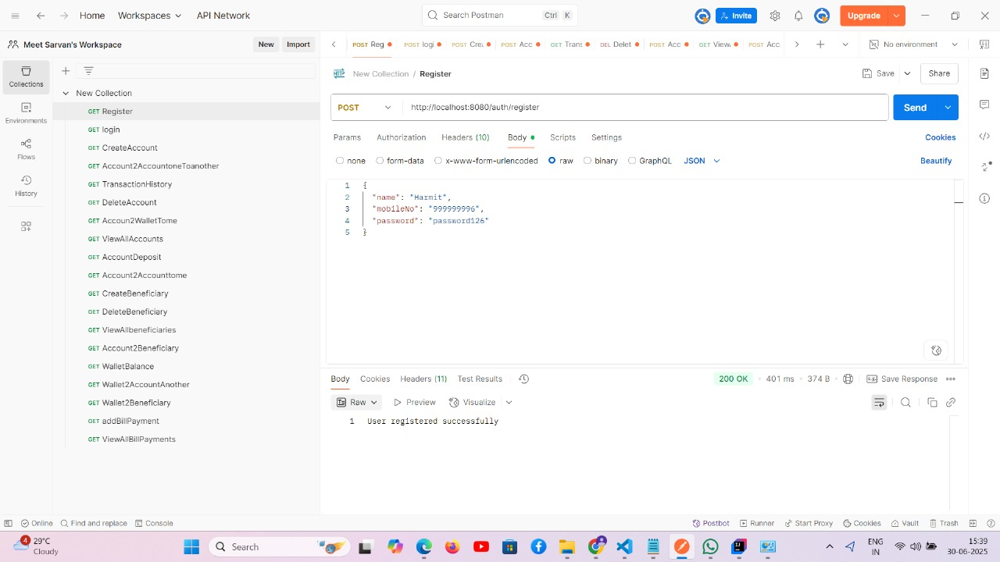
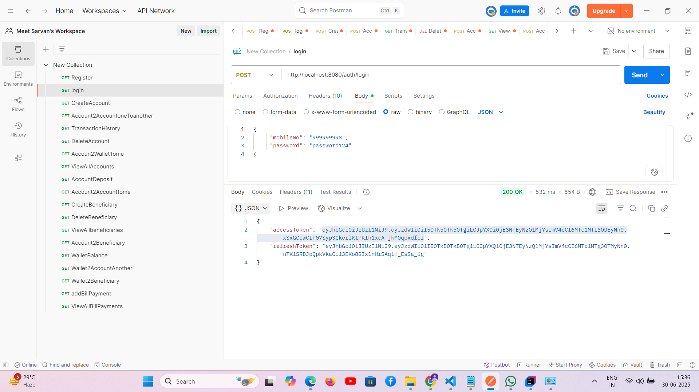

# PayKaro - Digital Banking System

PayKaro is a robust digital banking system built with Spring Boot that provides secure and efficient banking operations through RESTful APIs.

## Features

- 🔐 Secure Authentication & Authorization using JWT
- 💳 Account Management
- 👥 Beneficiary Management
- 💰 Wallet Operations
- 💸 Bill Payments
- 📊 Transaction History
- 🔄 Real-time Balance Updates

## Tech Stack

- **Framework:** Spring Boot
- **Security:** Spring Security with JWT
- **Database:** JPA/Hibernate
- **Build Tool:** Maven
- **Backend Testing:** Postman

## Prerequisites

- Java 17 or higher
- Maven
- MySQL Database

## Setup & Installation

1. **Clone the repository**
   ```bash
   git clone https://github.com/yourusername/Digital-Banking-System.git
   cd Digital-Banking-System/PayKaro
   ```

2. **Configure Database**
   - Open `src/main/resources/application.properties`
   - Update the database configuration with your MySQL credentials

3. **Build the project**
   ```bash
   mvn clean install
   ```

4. **Run the application**
   ```bash
   mvn spring:boot run
   ```

The application will start running at `http://localhost:8080`

## API Endpoints

### Authentication
- POST `/api/auth/login` - User login
- POST `/api/auth/refresh` - Refresh JWT token

### Account Management
- POST `/api/accounts` - Create new account
- GET `/api/accounts/{id}` - Get account details
- PUT `/api/accounts/{id}` - Update account

### Wallet Operations
- GET `/api/wallets/{id}` - Get wallet details
- POST `/api/wallets/transfer` - Transfer money
- GET `/api/wallets/balance/{id}` - Check balance

### Beneficiary Management
- POST `/api/beneficiaries` - Add beneficiary
- GET `/api/beneficiaries/{id}` - Get beneficiary details
- DELETE `/api/beneficiaries/{id}` - Remove beneficiary

### Bill Payments
- POST `/api/bills/pay` - Make bill payment
- GET `/api/bills/history` - Get payment history

### Transaction History
- GET `/api/transactions` - Get transaction history
- GET `/api/transactions/{id}` - Get specific transaction details

## Screenshots

Here are some screenshots of the application in action:

**User Registration**


**User Login**


## Security

The application implements robust security measures:
- JWT based authentication
- Password encryption
- Role-based access control
- Secure API endpoints

## Project Structure

```
src/main/java/com/paykaro/
├── configure/       # Configuration classes
├── controller/      # REST API controllers
├── dto/            # Data Transfer Objects
├── exception/      # Custom exceptions
├── model/          # Entity classes
├── repository/     # Data access layer
├── security/       # Security configurations
└── service/        # Business logic layer
```

## Contributing

1. Fork the repository
2. Create your feature branch (`git checkout -b feature/AmazingFeature`)
3. Commit your changes (`git commit -m 'Add some AmazingFeature'`)
4. Push to the branch (`git push origin feature/AmazingFeature`)
5. Open a Pull Request

## License

This project is licensed under the MIT License - see the LICENSE file for details.

## Support

For support, email support@paykaro.com or raise an issue in the repository. 